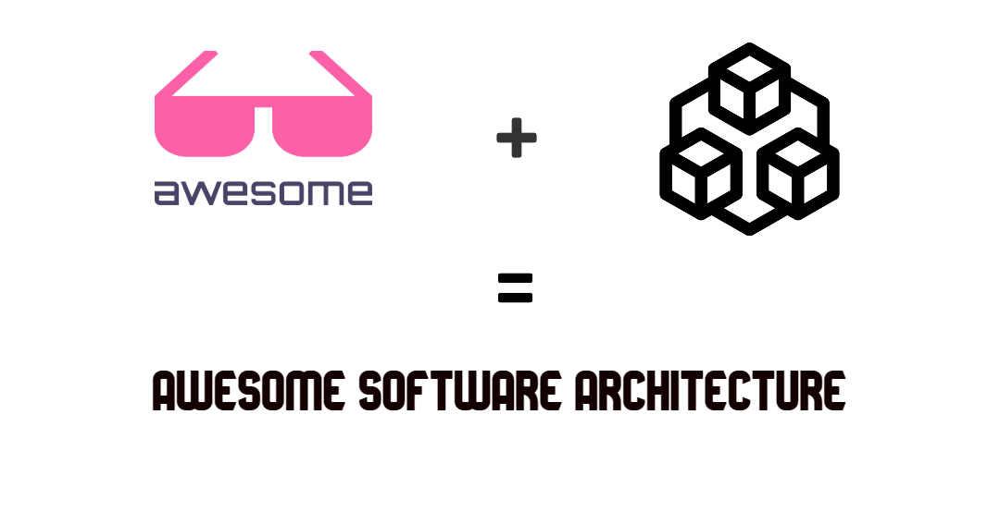
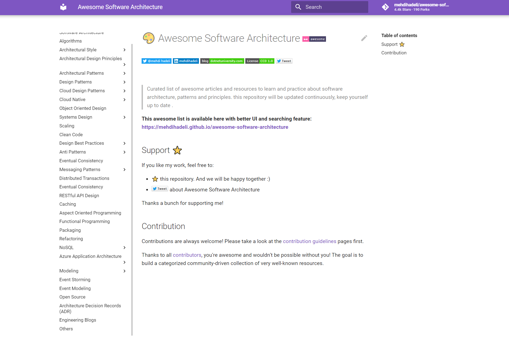

# 🎨 Awesome Software Architecture 

> Curated list of awesome articles and resources to learn and practice about software architecture, patterns and principles. this repository will be updated continuously, keep yourself up to date .

Hi! My name is [Mehdi Hadeli](https://github.com/mehdihadeli). I created this repository to share a set of links that I found valuable and inspiring. I hope that you'll like it!

**🚀 This awesome list is available in this link:**
**[https://awesome-architecture.com](https://awesome-architecture.com/)**

## Support ⭐

Star this repository, And we will be happy together :)

Thanks a bunch for supporting me!

## Contribution

Contributions are always welcome! Please take a look at the [contribution guidelines](https://github.com/mehdihadeli/awesome-software-architecture/blob/main/contributing.md)) pages first.

Thanks to all [contributors](https://github.com/mehdihadeli/awesome-software-architecture/graphs/contributors), you're awesome and wouldn't be possible without you! The goal is to build a categorized community-driven collection of very well-known resources.

# Contact
If you have any questions, let me know. You can reach me here:

<!-- markdown-link-check-disable-next-line -->

